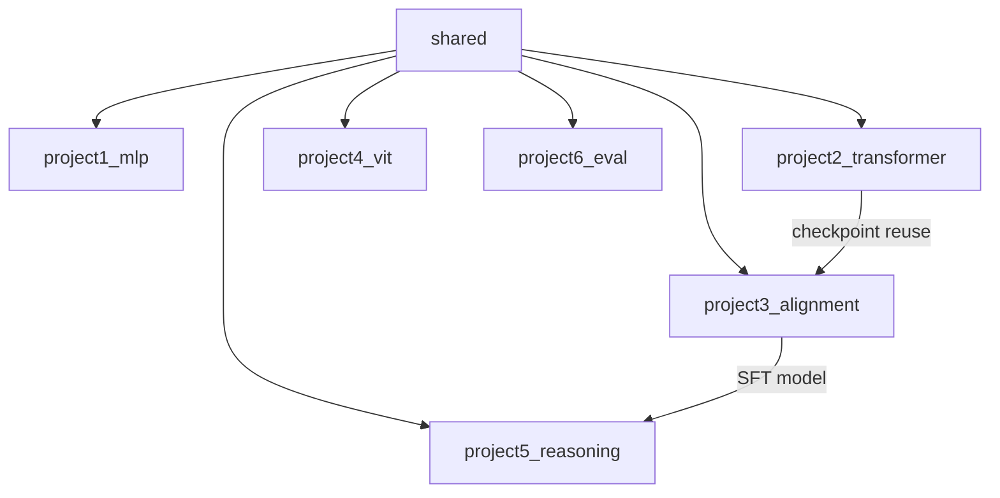

# Design Document: Deep Learning & LLM Mastery Curriculum

## Overview

This document specifies the technical design for a 6-project, research-grade deep learning and LLM mastery curriculum. The curriculum runs entirely on a CPU-only AMD Ryzen 9 laptop using PyTorch, and is structured as a monorepo where each project is a self-contained Python package. The design mirrors practices at top AI research labs: config-driven training, reproducible experiments, structured logging, modular code, and rigorous evaluation.

The six projects build on each other in a deliberate progression:

1. **Project 1** — MLP training loop fundamentals on California Housing (regression)
2. **Project 2** — GPT-style transformer pre-training on TinyStories (language modeling)
3. **Project 3** — SFT + RLHF/RLAIF on Alpaca + Anthropic HH-RLHF (alignment)
4. **Project 4** — Vision Transformer (ViT) on CIFAR-10 / ImageNette (vision)
5. **Project 5** — Reasoning and inference strategies on GSM8K + BIG-Bench Hard
6. **Project 6** — Professional benchmark evaluation via lm-evaluation-harness

---

## Architecture

### Repository Layout (Monorepo)

```
deep-learning-llm-mastery/
├── README.md                        # Top-level learning path, prerequisites, hardware
├── Makefile                         # setup / test / train-all / clean targets
├── pyproject.toml                   # Build system metadata (PEP 517/518)
├── requirements.txt                 # Pinned top-level deps (all projects)
├── .gitignore                       # Excludes checkpoints, datasets, logs, __pycache__
├── shared/                          # Cross-project utilities (installable package)
│   ├── __init__.py
│   ├── config.py                    # BaseConfig dataclass + YAML loader
│   ├── logging_utils.py             # JSONLogger, tqdm integration
│   ├── checkpointing.py             # save_checkpoint / load_checkpoint
│   ├── seed.py                      # fix_all_seeds(seed: int)
│   └── lr_schedule.py               # cosine_with_warmup scheduler factory
├── project1_mlp/
│   ├── README.md
│   ├── config.yaml
│   ├── config.py
│   ├── model.py
│   ├── data.py
│   ├── train.py
│   ├── evaluate.py
│   ├── visualize.py
│   └── tests/
│       ├── test_data.py
│       └── test_model.py
├── project2_transformer/
│   ├── README.md
│   ├── config.yaml
│   ├── config.py
│   ├── model.py
│   ├── tokenizer.py
│   ├── data.py
│   ├── train.py
│   ├── evaluate.py
│   ├── generate.py
│   ├── visualize.py
│   └── tests/
│       ├── test_tokenizer.py
│       ├── test_model.py
│       └── test_data.py
├── project3_alignment/
│   ├── README.md
│   ├── config.yaml
│   ├── config.py
│   ├── sft.py
│   ├── reward_model.py
│   ├── rlhf.py
│   ├── rlaif.py
│   ├── data.py
│   ├── evaluate.py
│   ├── compare.py
│   └── tests/
│       ├── test_reward_model.py
│       ├── test_rlhf.py
│       └── test_data.py
├── project4_vit/
│   ├── README.md
│   ├── config.yaml
│   ├── config.py
│   ├── model.py
│   ├── baseline.py
│   ├── data.py
│   ├── train.py
│   ├── evaluate.py
│   ├── visualize.py
│   ├── attention_viz.py
│   └── tests/
│       ├── test_model.py
│       └── test_data.py
├── project5_reasoning/
│   ├── README.md
│   ├── config.yaml
│   ├── config.py
│   ├── inference.py
│   ├── kv_cache.py
│   ├── reasoning.py
│   ├── data.py
│   ├── evaluate.py
│   ├── benchmark.py
│   └── tests/
│       ├── test_inference.py
│       ├── test_kv_cache.py
│       └── test_reasoning.py
├── project6_eval/
│   ├── README.md
│   ├── config.yaml
│   ├── config.py
│   ├── evaluate.py
│   ├── weight_analysis.py
│   ├── activation_analysis.py
│   ├── dataset_explorer.py
│   ├── report.py
│   └── tests/
│       ├── test_report.py
│       ├── test_error_handling.py
│       └── test_dataset_explorer.py
└── outputs/                         # Git-ignored: checkpoints, logs, plots
    ├── project1/
    ├── project2/
    ├── project3/
    ├── project4/
    ├── project5/
    └── project6/
```

### Dependency Graph



---

## Components and Interfaces

### Shared Utilities (`shared/`)

#### `shared/config.py`

```python
from dataclasses import dataclass, field, asdict
from typing import Any
import yaml

@dataclass
class BaseConfig:
    seed: int = 42
    output_dir: str = "outputs/"
    log_every_n_steps: int = 10
    checkpoint_every_n_epochs: int = 1

def load_config(path: str, config_cls: type) -> Any:
    """Load a YAML file and instantiate config_cls with its values."""
    ...

def save_config(config: BaseConfig, path: str) -> None:
    """Serialize config to YAML."""
    ...
```

#### `shared/logging_utils.py`

```python
import json
from pathlib import Path
from typing import Any

class JSONLogger:
    """Appends one JSON object per line to a log file."""
    def __init__(self, log_path: str) -> None: ...
    def log(self, entry: dict[str, Any]) -> None: ...
    def log_config(self, config: Any) -> None:
        """First call: serialize full config as first log entry."""
        ...
```

#### `shared/checkpointing.py`

```python
import torch
from pathlib import Path
from typing import Any

def save_checkpoint(
    path: str,
    model: torch.nn.Module,
    optimizer: torch.optim.Optimizer,
    scheduler: Any,
    epoch: int,
    step: int,
    best_metric: float,
    extra: dict[str, Any] | None = None,
) -> None: ...

def load_checkpoint(
    path: str,
    model: torch.nn.Module,
    optimizer: torch.optim.Optimizer | None = None,
    scheduler: Any | None = None,
) -> dict[str, Any]:
    """Returns dict with epoch, step, best_metric, extra."""
    ...
```

#### `shared/seed.py`

```python
def fix_all_seeds(seed: int) -> None:
    """Fix Python random, NumPy, and PyTorch seeds for reproducibility."""
    ...
```

#### `shared/lr_schedule.py`

```python
import torch

def cosine_with_warmup(
    optimizer: torch.optim.Optimizer,
    warmup_steps: int,
    total_steps: int,
    min_lr_ratio: float = 0.1,
) -> torch.optim.lr_scheduler.LambdaLR:
    """
    Linear warmup from 0 to base_lr over warmup_steps,
    then cosine decay to min_lr_ratio * base_lr.
    # Ref: Loshchilov & Hutter, 2017 — "SGDR: Stochastic Gradient Descent with Warm Restarts"
    """
    ...
```

---

## Data Models

### Config Dataclasses

Each project defines a typed config dataclass that extends `BaseConfig`:

```python
# project1_mlp/config.py
@dataclass
class MLPConfig(BaseConfig):
    # Data
    test_size: float = 0.1
    val_size: float = 0.1
    # Model
    hidden_dims: list[int] = field(default_factory=lambda: [128, 64, 32])
    dropout: float = 0.1
    init_strategy: str = "kaiming"   # "normal" | "xavier" | "kaiming"
    # Training
    batch_size: int = 32
    grad_accum_steps: int = 4
    max_epochs: int = 50
    learning_rate: float = 3e-4
    weight_decay: float = 1e-2
    grad_clip_norm: float = 1.0
    warmup_epochs: int = 5
    # Paths
    checkpoint_dir: str = "outputs/project1/checkpoints"
    log_path: str = "outputs/project1/experiment_log.jsonl"
    plot_dir: str = "outputs/project1/plots"
```

```python
# project2_transformer/config.py
@dataclass
class TransformerConfig(BaseConfig):
    # Data
    dataset_name: str = "roneneldan/TinyStories"
    max_stories: int = 50_000
    val_fraction: float = 0.05
    context_length: int = 256
    vocab_size: int = 8_000
    # Model
    n_layers: int = 4
    n_heads: int = 4
    d_model: int = 128
    d_ff: int = 512          # 4 * d_model
    dropout: float = 0.1
    # Training
    batch_size: int = 16
    grad_accum_steps: int = 16   # effective batch = 256
    max_steps: int = 10_000
    learning_rate: float = 3e-4
    weight_decay: float = 1e-1
    grad_clip_norm: float = 1.0
    warmup_steps: int = 500
    # Paths
    tokenizer_dir: str = "outputs/project2/tokenizer"
    checkpoint_dir: str = "outputs/project2/checkpoints"
    log_path: str = "outputs/project2/experiment_log.jsonl"
```

```python
# project3_alignment/config.py
@dataclass
class AlignmentConfig(BaseConfig):
    # Base model
    base_model_name: str = "gpt2"   # or path to project2 checkpoint
    # SFT
    sft_dataset: str = "tatsu-lab/alpaca"
    sft_val_fraction: float = 0.1
    sft_max_epochs: int = 3
    sft_lr: float = 2e-5
    sft_batch_size: int = 8
    sft_grad_accum_steps: int = 4
    # Reward model
    rm_dataset: str = "Anthropic/hh-rlhf"
    rm_max_epochs: int = 2
    rm_lr: float = 1e-5
    # RLHF / PPO
    ppo_steps: int = 500
    ppo_lr: float = 1e-6
    kl_coeff: float = 0.1
    reward_clip_bound: float = 5.0
    # RLAIF
    rlaif_model: str = "google/flan-t5-small"
    # Paths
    checkpoint_dir: str = "outputs/project3/checkpoints"
    log_path: str = "outputs/project3/experiment_log.jsonl"
    comparison_file: str = "outputs/project3/stage_comparison.json"
```

```python
# project4_vit/config.py
@dataclass
class ViTConfig(BaseConfig):
    # Data
    dataset: str = "cifar10"   # "cifar10" | "imagenette"
    # Model
    image_size: int = 32
    patch_size: int = 4        # 4 or 8
    n_channels: int = 3
    n_classes: int = 10
    d_model: int = 128
    n_heads: int = 4
    n_layers: int = 6
    d_ff: int = 512
    dropout: float = 0.1
    # Training
    batch_size: int = 64
    max_epochs: int = 30
    learning_rate: float = 3e-4
    weight_decay: float = 1e-2
    warmup_epochs: int = 5
    grad_clip_norm: float = 1.0
    # Paths
    checkpoint_dir: str = "outputs/project4/checkpoints"
    log_path: str = "outputs/project4/experiment_log.jsonl"
    plot_dir: str = "outputs/project4/plots"
```

```python
# project5_reasoning/config.py
@dataclass
class ReasoningConfig(BaseConfig):
    # Model
    model_name: str = "gpt2"
    # Inference
    max_new_tokens: int = 200
    beam_width: int = 4
    top_k: int = 50
    top_p: float = 0.9
    temperature: float = 1.0
    # Evaluation
    gsm8k_subset_size: int = 50
    bigbench_subset_size: int = 50
    # Paths
    benchmark_file: str = "outputs/project5/benchmark_results.json"
    log_path: str = "outputs/project5/experiment_log.jsonl"
```

```python
# project6_eval/config.py
@dataclass
class EvalConfig(BaseConfig):
    # Models to evaluate
    models: list[str] = field(default_factory=lambda: ["gpt2", "EleutherAI/pythia-160m"])
    # Benchmarks: task_name -> num_fewshot
    tasks: dict[str, int] = field(default_factory=lambda: {
        "arc_challenge": 25,
        "hellaswag": 10,
        "mmlu": 5,
        "truthfulqa_mc": 0,
    })
    # Paths
    output_dir: str = "outputs/project6"
    log_path: str = "outputs/project6/experiment_log.jsonl"
    report_csv: str = "outputs/project6/results.csv"
    report_md: str = "outputs/project6/results.md"
```

### Experiment Log Schema

Every project appends newline-delimited JSON to its log file. The first entry is always the full config:

```json
{"type": "config", "timestamp": "...", "config": {...}, "library_versions": {"torch": "...", "transformers": "..."}}
{"type": "train_step", "epoch": 1, "step": 10, "train_loss": 0.45, "lr": 3e-4, "grad_norm": 0.8}
{"type": "val_epoch", "epoch": 1, "val_loss": 0.42, "val_rmse": 0.61, "val_mae": 0.44}
{"type": "checkpoint", "epoch": 1, "path": "outputs/project1/checkpoints/epoch_1.pt"}
```

### Checkpoint Schema

All checkpoints are PyTorch `.pt` files with a consistent dict structure:

```python
{
    "model_state_dict": ...,
    "optimizer_state_dict": ...,
    "scheduler_state_dict": ...,
    "epoch": int,
    "step": int,
    "best_metric": float,
    "config": dict,   # full config snapshot
}
```

---

## Correctness Properties

*A property is a characteristic or behavior that should hold true across all valid executions of a system — essentially, a formal statement about what the system should do. Properties serve as the bridge between human-readable specifications and machine-verifiable correctness guarantees.*

This curriculum involves pure functions (data splitting, tokenization, model forward passes, inference strategies, serialization) with large input spaces where 100+ iterations reveal edge cases. Property-based testing using [Hypothesis](https://hypothesis.readthedocs.io/) is appropriate for these components.

**Property Reflection:** After reviewing all prework items, the following consolidations were made:
- Split disjointness (1.2, 2.2, 3.12) → single Property 1 covering all projects
- Checkpoint round-trip (1.5, 2.6, 4.9) → single Property 3
- LR schedule monotonicity (1.3, 2.5, 4.10) → single Property 4
- Output shape invariants (1.10, 2.1, 2.10, 4.1, 4.12) → consolidated into Property 2 and Property 5
- Reproducibility (2.8, 5.8) → single Property 8
- KV cache correctness (5.4, 5.11) → single Property 9

---

### Property 1: Data Split Disjointness

*For any* dataset of size N split into train/val/test fractions, the resulting index sets SHALL be pairwise disjoint and their union SHALL equal the full index set of size N.

**Validates: Requirements 1.2, 2.2, 3.1, 3.12**

---

### Property 2: MLP Forward Pass Shape Invariant

*For any* batch size B and valid input tensor of shape (B, input_dim), the MLP forward pass SHALL produce an output tensor of shape (B, 1) without raising a runtime error.

**Validates: Requirements 1.1, 1.10**

---

### Property 3: Checkpoint Round-Trip Fidelity

*For any* model with arbitrary weight values, saving a checkpoint and then loading it SHALL produce a model whose state_dict is element-wise identical to the original (all tensors equal under `torch.allclose`).

**Validates: Requirements 1.5, 2.6, 4.9**

---

### Property 4: LR Schedule Monotonicity

*For any* valid (warmup_steps, total_steps) pair where warmup_steps < total_steps, the cosine-with-warmup scheduler SHALL produce LR values that are monotonically non-decreasing during the warmup phase and monotonically non-increasing during the cosine decay phase.

**Validates: Requirements 1.3, 2.5, 4.10**

---

### Property 5: Transformer Output Shape Invariant

*For any* batch size B and sequence length T where 1 <= T <= context_length, the GPT model forward pass SHALL produce logits of shape (B, T, vocab_size) without raising a runtime error.

**Validates: Requirements 2.1, 2.10**

---

### Property 6: Tokenizer Round-Trip

*For any* non-empty string of valid Unicode text, the BPE tokenizer SHALL satisfy: `tokenizer.decode(tokenizer.encode(text)) == text`.

**Validates: Requirements 2.3, 2.12**

---

### Property 7: Causal Attention Mask Correctness

*For any* sequence length T, the causal attention mask SHALL ensure that position i attends only to positions j <= i — i.e., the upper triangle of the attention weight matrix (above the diagonal) SHALL be zero after softmax.

**Validates: Requirements 2.12**

---

### Property 8: Inference Reproducibility Under Fixed Seed

*For any* inference strategy (greedy, beam search, top-k, top-p), model, input prompt, and integer seed, running the strategy twice with the same seed SHALL produce byte-identical output token sequences.

**Validates: Requirements 2.8, 5.8**

---

### Property 9: KV Cache Output Equivalence

*For any* model and input sequence of length T, autoregressive generation with KV cache enabled SHALL produce logits that are element-wise identical (within floating-point tolerance) to generation without KV cache.

**Validates: Requirements 5.4, 5.11**

---

### Property 10: Reward Clipping Invariant

*For any* reward value r and clip bound b > 0, the clipped reward SHALL satisfy: `-b <= clip(r, -b, b) <= b`.

**Validates: Requirements 3.9**

---

### Property 11: KL Divergence Non-Negativity

*For any* two valid probability distributions p and q over the same vocabulary, the KL divergence KL(p || q) SHALL be >= 0.

**Validates: Requirements 3.5**

---

### Property 12: Patch Embedding Shape Invariant

*For any* batch of images of shape (B, C, H, W) where H and W are divisible by patch_size, the PatchEmbedding module SHALL produce an output of shape (B, (H/patch_size)*(W/patch_size), d_model).

**Validates: Requirements 4.1, 4.12**

---

### Property 13: Reward Model Output Shape Invariant

*For any* batch of input_ids of shape (B, T), the RewardModel SHALL produce a scalar reward tensor of shape (B,) without raising a runtime error.

**Validates: Requirements 3.4, 3.12**

---

### Property 14: Evaluation Report Column Completeness

*For any* dict of model evaluation results, the generated CSV report SHALL contain exactly the columns: Model, ARC-Challenge, HellaSwag, MMLU, TruthfulQA, Average — in that order.

**Validates: Requirements 6.3, 6.12**

---

### Property 15: Graceful Continuation on Task Failure

*For any* list of evaluation tasks where a subset raises exceptions, the evaluation runner SHALL complete all non-failing tasks and return results for them, logging each failure without re-raising.

**Validates: Requirements 6.10, 6.12**

---

### Property 16: Seed Reproducibility

*For any* integer seed value, calling `fix_all_seeds(seed)` twice in sequence SHALL produce identical sequences of random numbers from `torch.rand`, `numpy.random.rand`, and `random.random`.

**Validates: Requirements 7.4**

---

### Property 17: Config Round-Trip Serialization

*For any* config dataclass instance, serializing to YAML and deserializing back SHALL produce an object with identical field values.

**Validates: Requirements 7.2, 7.3**

---

### Property 18: Activation Statistics Validity

*For any* valid input tensor passed through the MLP, the activation statistics utility SHALL return finite (non-NaN, non-Inf) mean and std values, and dead_fraction values in the range [0.0, 1.0] for every layer.

**Validates: Requirements 1.8**

---

## Error Handling

### Training Loop Errors

| Error | Detection | Response |
|---|---|---|
| NaN loss | Check `torch.isnan(loss)` after each step | Log warning with step/epoch, skip optimizer step, continue |
| Exploding gradients | `clip_grad_norm_` returns grad_norm | Log if grad_norm > 10x clip threshold |
| OOM (CPU) | `MemoryError` | Log error, save emergency checkpoint, re-raise |
| Checkpoint load failure | `FileNotFoundError`, `RuntimeError` | Log error with path, start from scratch with warning |

### Data Pipeline Errors

| Error | Detection | Response |
|---|---|---|
| Dataset download failure | `ConnectionError`, `requests.HTTPError` | Log error with dataset name and URL, raise with helpful message |
| Corrupt dataset | Shape mismatch, unexpected None | Validate shapes after loading, raise `ValueError` with details |
| Empty split | Split size == 0 | Raise `ValueError` before training starts |

### Project 6 Specific

| Error | Detection | Response |
|---|---|---|
| Model load failure | `OSError`, `ValueError` from HF | Log `{model_name, error_type, traceback_summary}`, skip model, continue |
| Task evaluation failure | Any exception in `lm_eval` | Log `{model_name, task_name, traceback_summary}`, mark task as failed, continue |
| Report generation failure | `KeyError` on missing task | Fill missing task with `None`, log warning |

---

## Testing Strategy

### Dual Testing Approach

Every project uses both unit/example tests and property-based tests:

- **Unit tests**: verify specific examples, edge cases, integration points
- **Property tests**: verify universal invariants across randomly generated inputs using [Hypothesis](https://hypothesis.readthedocs.io/)

### Property-Based Testing with Hypothesis

All 18 correctness properties above are implemented as Hypothesis property tests. Each test runs a minimum of 100 iterations (configured via `@settings(max_examples=100)`).

Tag format in test files:
```python
# Feature: deep-learning-llm-mastery, Property 1: Data Split Disjointness
@given(n=st.integers(min_value=10, max_value=10_000), ...)
@settings(max_examples=100)
def test_split_disjointness(n, ...):
    ...
```

### Per-Project Test Coverage

#### Project 1 (`project1_mlp/tests/`)

| Test | Type | Property |
|---|---|---|
| `test_split_disjointness` | Property | Property 1 |
| `test_mlp_output_shape` | Property | Property 2 |
| `test_checkpoint_round_trip` | Property | Property 3 |
| `test_lr_schedule_monotonicity` | Property | Property 4 |
| `test_activation_stats_validity` | Property | Property 18 |
| `test_init_strategies_differ` | Example | Req 1.7 |
| `test_no_data_leakage` | Example | Req 1.2 |

#### Project 2 (`project2_transformer/tests/`)

| Test | Type | Property |
|---|---|---|
| `test_transformer_output_shape` | Property | Property 5 |
| `test_tokenizer_round_trip` | Property | Property 6 |
| `test_causal_mask_correctness` | Property | Property 7 |
| `test_inference_reproducibility` | Property | Property 8 |
| `test_config_serialization` | Property | Property 17 |
| `test_dataloader_output_shapes` | Example | Req 2.12 |

#### Project 3 (`project3_alignment/tests/`)

| Test | Type | Property |
|---|---|---|
| `test_reward_model_output_shape` | Property | Property 13 |
| `test_kl_divergence_non_negative` | Property | Property 11 |
| `test_reward_clipping` | Property | Property 10 |
| `test_split_no_overlap` | Property | Property 1 |
| `test_sft_prompt_format` | Example | Req 3.3 |

#### Project 4 (`project4_vit/tests/`)

| Test | Type | Property |
|---|---|---|
| `test_patch_embedding_shape` | Property | Property 12 |
| `test_vit_output_shape` | Property | Property 5 (adapted) |
| `test_checkpoint_round_trip` | Property | Property 3 |
| `test_normalization_range` | Property | Req 4.4 |
| `test_dataloader_shapes` | Example | Req 4.12 |

#### Project 5 (`project5_reasoning/tests/`)

| Test | Type | Property |
|---|---|---|
| `test_kv_cache_equivalence` | Property | Property 9 |
| `test_inference_reproducibility` | Property | Property 8 |
| `test_beam_search_width_invariant` | Property | Req 5.11 |
| `test_greedy_decode_shapes` | Example | Req 5.1 |

#### Project 6 (`project6_eval/tests/`)

| Test | Type | Property |
|---|---|---|
| `test_report_column_completeness` | Property | Property 14 |
| `test_graceful_continuation` | Property | Property 15 |
| `test_dataset_streaming_format` | Property | Req 6.7 |
| `test_error_logging_format` | Example | Req 6.10 |

### Unit Test Balance

Unit tests focus on:
- Integration points (data loader → model → loss)
- Specific edge cases (empty sequences, single-element batches, maximum context length)
- Error conditions (invalid config values, missing checkpoint files)

Property tests handle broad input coverage. The goal is ~30% unit tests, ~70% property tests by count, with property tests covering all 18 correctness properties.

### Performance Constraints (not property-tested)

| Project | CPU Time Budget | Verification |
|---|---|---|
| Project 1 | < 5 minutes end-to-end | Manual timing in CI |
| Project 2 | < 2 hours for 10K steps | Manual timing |
| Project 3 | < 90 minutes all stages | Manual timing |
| Project 4 | < 45 minutes CIFAR-10 | Manual timing |
| Project 6 | < 2 hours full eval suite | Manual timing |

---

## Project 1: MLP Training Loop

### Module Architecture

```
project1_mlp/
├── config.py       — MLPConfig dataclass
├── data.py         — California Housing loading, splitting, normalization
├── model.py        — MLP class, weight init strategies, activation stats
├── train.py        — training loop with grad accum, LR schedule, checkpointing
├── evaluate.py     — RMSE / MAE on test set
└── visualize.py    — loss curves, init strategy comparison plot
```

#### `model.py` — Key Signatures

```python
class MLP(nn.Module):
    """
    Multi-layer perceptron for regression.
    # Ref: He et al., 2015 — "Delving Deep into Rectifiers" — Kaiming init
    # Ref: Glorot & Bengio, 2010 — "Understanding the difficulty of training deep NNs" — Xavier init
    """
    def __init__(self, input_dim: int, hidden_dims: list[int], dropout: float) -> None: ...
    def forward(self, x: torch.Tensor) -> torch.Tensor: ...

def initialize_weights(model: MLP, strategy: str) -> None:
    """Apply 'normal' | 'xavier' | 'kaiming' initialization to all Linear layers."""
    ...

def activation_stats(model: MLP, x: torch.Tensor) -> dict[str, dict[str, float]]:
    """
    Run a forward pass with hooks; return per-layer dict of
    {mean, std, dead_fraction} for each activation tensor.
    """
    ...
```

#### `data.py` — Key Signatures

```python
def load_california_housing(
    val_size: float,
    test_size: float,
    seed: int,
) -> tuple[DataLoader, DataLoader, DataLoader]:
    """
    Load from sklearn, normalize features (StandardScaler fit on train only),
    return (train_loader, val_loader, test_loader).
    No data leakage: scaler fit only on train split.
    """
    ...
```

#### `train.py` — Training Loop Design

```python
def train(config: MLPConfig) -> None:
    fix_all_seeds(config.seed)
    logger = JSONLogger(config.log_path)
    logger.log_config(config)

    train_loader, val_loader, test_loader = load_california_housing(...)
    model = MLP(...)
    initialize_weights(model, config.init_strategy)
    optimizer = torch.optim.AdamW(model.parameters(), lr=config.learning_rate, weight_decay=config.weight_decay)
    scheduler = cosine_with_warmup(optimizer, warmup_steps=..., total_steps=...)

    for epoch in range(config.max_epochs):
        # Gradient accumulation loop
        optimizer.zero_grad()
        for micro_step, (x, y) in enumerate(train_loader):
            loss = criterion(model(x), y) / config.grad_accum_steps
            loss.backward()
            if (micro_step + 1) % config.grad_accum_steps == 0:
                grad_norm = nn.utils.clip_grad_norm_(model.parameters(), config.grad_clip_norm)
                optimizer.step()
                scheduler.step()
                optimizer.zero_grad()
                logger.log({"type": "train_step", "loss": ..., "lr": ..., "grad_norm": ...})
        # Validation
        val_rmse, val_mae = evaluate(model, val_loader)
        logger.log({"type": "val_epoch", "epoch": epoch, "val_rmse": val_rmse, ...})
        # Checkpoint
        if val_rmse < best_val_rmse:
            save_checkpoint(config.checkpoint_dir + "/best.pt", model, optimizer, scheduler, epoch, step, val_rmse)
```

### Data Pipeline

| Stage | Source | Transform | Output |
|---|---|---|---|
| Load | `sklearn.datasets.fetch_california_housing` | None | numpy arrays |
| Split | `train_test_split` (80/10/10, seed=42) | Stratified by target quantile | 3 numpy arrays |
| Normalize | `StandardScaler` fit on train only | z-score features | normalized arrays |
| Batch | `torch.utils.data.TensorDataset` + `DataLoader` | shuffle=True (train only) | `(B, 8)` feature tensors |

### Model Architecture

| Hyperparameter | Default Value |
|---|---|
| Input dim | 8 (California Housing features) |
| Hidden dims | [128, 64, 32] |
| Activation | ReLU |
| Dropout | 0.1 |
| Output dim | 1 (regression) |
| Total parameters | ~12,000 |
| Init strategy | Kaiming He (default) |

### Training Hyperparameters

| Hyperparameter | Default Value | Notes |
|---|---|---|
| Optimizer | AdamW | Loshchilov & Hutter, 2019 |
| Learning rate | 3e-4 | Peak LR after warmup |
| Weight decay | 1e-2 | L2 regularization |
| Batch size | 32 | Per micro-batch |
| Grad accum steps | 4 | Effective batch = 128 |
| Max epochs | 50 | |
| Warmup epochs | 5 | Linear warmup |
| Grad clip norm | 1.0 | |
| LR schedule | Cosine decay | Min LR = 3e-5 |

### Evaluation and Visualization

- `evaluate.py`: computes RMSE and MAE on test set, prints formatted table
- `visualize.py`:
  - `plot_loss_curves(log_path, output_path)` — train/val loss vs epoch
  - `plot_init_comparison(logs: list[str], labels: list[str], output_path)` — overlaid val loss for 3 init strategies

---

## Project 2: Transformer Pre-training

### Module Architecture

```
project2_transformer/
├── config.py       — TransformerConfig dataclass
├── tokenizer.py    — BPE tokenizer training and encode/decode
├── data.py         — TinyStories streaming, chunking into context windows
├── model.py        — GPT decoder-only transformer
├── train.py        — pre-training loop
├── evaluate.py     — perplexity on validation set
├── generate.py     — greedy and nucleus sampling
└── visualize.py    — attention heatmaps, weight distributions
```

#### `model.py` — Key Signatures

```python
class CausalSelfAttention(nn.Module):
    """
    Multi-head causal self-attention with pre-norm.
    # Ref: Vaswani et al., 2017 — "Attention Is All You Need"
    # Ref: Radford et al., 2019 — "Language Models are Unsupervised Multitask Learners" (GPT-2)
    """
    def __init__(self, d_model: int, n_heads: int, dropout: float, context_length: int) -> None: ...
    def forward(self, x: torch.Tensor) -> torch.Tensor:
        """x: (B, T, d_model) -> (B, T, d_model). Causal mask applied internally."""
        ...

class TransformerBlock(nn.Module):
    def __init__(self, d_model: int, n_heads: int, d_ff: int, dropout: float, context_length: int) -> None: ...
    def forward(self, x: torch.Tensor) -> torch.Tensor: ...

class GPTModel(nn.Module):
    """
    Decoder-only transformer with weight-tied embedding and LM head.
    """
    def __init__(self, config: TransformerConfig) -> None: ...
    def forward(
        self, input_ids: torch.Tensor, targets: torch.Tensor | None = None
    ) -> tuple[torch.Tensor, torch.Tensor | None]:
        """
        Returns (logits, loss).
        logits shape: (B, T, vocab_size)
        loss: cross-entropy if targets provided, else None
        """
        ...
    def count_parameters(self) -> int: ...
```

#### `tokenizer.py` — Key Signatures

```python
class BPETokenizer:
    """Wraps HuggingFace tokenizers.ByteLevelBPETokenizer."""
    def train(self, texts: list[str], vocab_size: int, save_dir: str) -> None: ...
    def encode(self, text: str) -> list[int]: ...
    def decode(self, ids: list[int]) -> str: ...
    def save(self, save_dir: str) -> None: ...

    @classmethod
    def load(cls, save_dir: str) -> "BPETokenizer": ...
```

#### `generate.py` — Key Signatures

```python
def greedy_decode(
    model: GPTModel,
    input_ids: torch.Tensor,
    max_new_tokens: int,
) -> torch.Tensor: ...

def nucleus_sample(
    model: GPTModel,
    input_ids: torch.Tensor,
    max_new_tokens: int,
    top_p: float,
    temperature: float,
    seed: int | None = None,
) -> torch.Tensor: ...
```

### Data Pipeline

| Stage | Source | Transform | Output |
|---|---|---|---|
| Download | `datasets.load_dataset("roneneldan/TinyStories", streaming=True)` | Take first 50K stories | HF Dataset |
| Tokenize | `BPETokenizer.encode` | BPE, vocab_size=8000 | list of int IDs |
| Chunk | Concatenate all IDs, split into `context_length=256` windows | Stride = context_length | `(T,)` tensors |
| Batch | `DataLoader(shuffle=True)` | Pad to context_length | `(B, T)` input_ids |

### Model Architecture

| Hyperparameter | Default Value | Notes |
|---|---|---|
| Vocab size | 8,000 | BPE trained on TinyStories |
| Context length | 256 tokens | |
| d_model | 128 | Embedding dimension |
| n_layers | 4 | Transformer blocks |
| n_heads | 4 | Attention heads |
| d_ff | 512 | FFN hidden dim (4x d_model) |
| Dropout | 0.1 | |
| Activation | GELU | |
| Norm | Pre-LayerNorm | |
| Weight tying | Yes | Embedding and LM head |
| Total parameters | ~3.5M | |

### Training Hyperparameters

| Hyperparameter | Default Value |
|---|---|
| Optimizer | AdamW (b1=0.9, b2=0.95) |
| Learning rate | 3e-4 |
| Weight decay | 0.1 |
| Batch size | 16 |
| Grad accum steps | 16 (effective batch = 256) |
| Max steps | 10,000 |
| Warmup steps | 500 |
| Grad clip norm | 1.0 |
| LR schedule | Cosine decay |

### Evaluation and Visualization

- `evaluate.py`: `compute_perplexity(model, val_loader) -> float` — exp(mean cross-entropy)
- `visualize.py`:
  - `plot_attention_heatmaps(model, input_ids, tokenizer, save_dir)` — per-head attention matrices
  - `plot_weight_distributions(model, save_dir)` — histograms + spectral norms per layer

---

## Project 3: Alignment (SFT + RLHF + RLAIF)

### Module Architecture

```
project3_alignment/
├── config.py        — AlignmentConfig dataclass
├── data.py          — Alpaca and HH-RLHF data loading, prompt formatting
├── sft.py           — supervised fine-tuning loop
├── reward_model.py  — reward model definition and training
├── rlhf.py          — PPO-style RLHF loop with KL penalty
├── rlaif.py         — FLAN-T5-small as AI preference scorer
├── evaluate.py      — per-layer gradient logging, reward accuracy
└── compare.py       — before/after output comparison across stages
```

#### `reward_model.py` — Key Signatures

```python
class RewardModel(nn.Module):
    """
    Wraps a transformer backbone with a scalar reward head.
    # Ref: Ouyang et al., 2022 — "Training language models to follow instructions with human feedback"
    # Ref: Bai et al., 2022 — "Training a Helpful and Harmless Assistant with RLHF"
    """
    def __init__(self, backbone: nn.Module, d_model: int) -> None: ...
    def forward(self, input_ids: torch.Tensor, attention_mask: torch.Tensor) -> torch.Tensor:
        """Returns scalar reward per sequence. Shape: (B,)"""
        ...

def train_reward_model(
    model: RewardModel,
    chosen_loader: DataLoader,
    rejected_loader: DataLoader,
    config: AlignmentConfig,
) -> None:
    """Bradley-Terry loss: log sigmoid(r_chosen - r_rejected)"""
    ...
```

#### `rlhf.py` — PPO Loop Design

```python
def ppo_step(
    policy: nn.Module,
    ref_policy: nn.Module,
    reward_model: RewardModel,
    batch: dict[str, torch.Tensor],
    config: AlignmentConfig,
    logger: JSONLogger,
) -> dict[str, float]:
    """
    One PPO update step:
    1. Generate responses from policy
    2. Score with reward model (clip to +-reward_clip_bound)
    3. Compute KL(policy || ref_policy)
    4. reward_adjusted = reward - kl_coeff * KL
    5. Policy gradient update
    Returns dict of {reward, kl, policy_loss, value_loss}
    """
    ...
```

### Data Pipeline

#### Alpaca (SFT)

| Stage | Source | Transform | Output |
|---|---|---|---|
| Load | `datasets.load_dataset("tatsu-lab/alpaca")` | 90/10 split | HF Dataset |
| Format | Alpaca prompt template | `"### Instruction:\n{instruction}\n\n### Response:\n{output}"` | string |
| Tokenize | GPT-2 tokenizer | Truncate to 512 tokens | `(B, T)` |

#### HH-RLHF (Reward Model)

| Stage | Source | Transform | Output |
|---|---|---|---|
| Load | `datasets.load_dataset("Anthropic/hh-rlhf")` | chosen/rejected pairs | HF Dataset |
| Tokenize | GPT-2 tokenizer | Truncate to 512 tokens | paired `(B, T)` tensors |
| Split | 90/10 train/val | Fixed seed | DataLoaders |

### Model Architecture

| Component | Architecture | Parameters |
|---|---|---|
| SFT model | GPT-2 small (HF) | 117M |
| Reward model | GPT-2 small + linear head | ~117M |
| Policy (RLHF) | SFT checkpoint | 117M |
| Reference policy | Frozen SFT checkpoint | 117M |
| RLAIF scorer | FLAN-T5-small | 80M |

### Training Hyperparameters

| Stage | LR | Epochs/Steps | Batch | Grad Accum |
|---|---|---|---|---|
| SFT | 2e-5 | 3 epochs | 8 | 4 |
| Reward model | 1e-5 | 2 epochs | 8 | 4 |
| PPO | 1e-6 | 500 steps | 4 | 1 |

---

## Project 4: Vision Transformer

### Module Architecture

```
project4_vit/
├── config.py         — ViTConfig dataclass
├── data.py           — CIFAR-10 / ImageNette loading, augmentation
├── model.py          — ViT: patch embed, class token, transformer encoder, MLP head
├── baseline.py       — Small ResNet-18 CNN baseline
├── train.py          — shared training loop for ViT and CNN
├── evaluate.py       — top-1 accuracy
├── visualize.py      — training curves, patch grid visualization
└── attention_viz.py  — attention rollout, class token heatmaps
```

#### `model.py` — Key Signatures

```python
class PatchEmbedding(nn.Module):
    """
    Splits image into non-overlapping patches and projects to d_model.
    # Ref: Dosovitskiy et al., 2020 — "An Image is Worth 16x16 Words"
    """
    def __init__(self, image_size: int, patch_size: int, n_channels: int, d_model: int) -> None: ...
    def forward(self, x: torch.Tensor) -> torch.Tensor:
        """x: (B, C, H, W) -> (B, n_patches, d_model)"""
        ...

class ViT(nn.Module):
    def __init__(self, config: ViTConfig) -> None: ...
    def forward(self, x: torch.Tensor) -> torch.Tensor:
        """x: (B, C, H, W) -> (B, n_classes) logits"""
        ...
    def get_attention_weights(self, x: torch.Tensor) -> list[torch.Tensor]:
        """Returns list of attention weight tensors, one per layer. Shape: (B, n_heads, T, T)"""
        ...
```

#### `attention_viz.py` — Key Signatures

```python
def attention_rollout(
    attention_weights: list[torch.Tensor],
    discard_ratio: float = 0.9,
) -> torch.Tensor:
    """
    Abnar & Zuidema (2020) attention rollout.
    # Ref: Abnar & Zuidema, 2020 — "Quantifying Attention Flow in Transformers"
    Returns: (n_patches,) relevance scores for each patch.
    """
    ...

def overlay_attention_on_image(
    image: torch.Tensor,
    rollout: torch.Tensor,
    patch_size: int,
    save_path: str,
) -> None: ...
```

### Data Pipeline

#### CIFAR-10

| Stage | Source | Transform | Output |
|---|---|---|---|
| Load | `torchvision.datasets.CIFAR10` | Auto-download | PIL images |
| Train augment | `RandomHorizontalFlip`, `RandomCrop(32, padding=4)`, `Normalize` | Per-image | `(3, 32, 32)` |
| Val/test | `Normalize` only | Per-image | `(3, 32, 32)` |
| Val split | 10% of train (5,000 images) | Fixed seed | DataLoaders |

#### ImageNette (optional)

| Stage | Source | Transform |
|---|---|---|
| Load | `datasets.load_dataset("frgfm/imagenette")` | Resize to 224x224 |
| Augment | Same as CIFAR-10 + center crop | |

### Model Architecture

| Hyperparameter | Patch=4 | Patch=8 |
|---|---|---|
| Image size | 32x32 | 32x32 |
| n_patches | 64 | 16 |
| d_model | 128 | 128 |
| n_heads | 4 | 4 |
| n_layers | 6 | 6 |
| d_ff | 512 | 512 |
| Parameters | ~1.8M | ~1.5M |

### CNN Baseline Architecture

Small ResNet-18 variant adapted for 32x32 CIFAR-10:
- 4 residual blocks: [64, 128, 256, 512] channels
- Global average pooling -> linear classifier
- ~11M parameters (standard ResNet-18)

---

## Project 5: Reasoning and Inference

### Module Architecture

```
project5_reasoning/
├── config.py      — ReasoningConfig dataclass
├── data.py        — GSM8K and BIG-Bench Hard loading
├── inference.py   — greedy, beam search, top-k, top-p, temperature
├── kv_cache.py    — KV cache implementation
├── reasoning.py   — CoT prompting, scratchpad loop
├── evaluate.py    — exact-match accuracy, distinct-n diversity
└── benchmark.py   — comparison table generation
```

#### `inference.py` — Key Signatures

```python
def greedy_decode(
    model: nn.Module,
    input_ids: torch.Tensor,
    max_new_tokens: int,
    tokenizer: Any,
) -> tuple[torch.Tensor, list[torch.Tensor]]:
    """Returns (output_ids, per_step_log_probs)"""
    ...

def beam_search(
    model: nn.Module,
    input_ids: torch.Tensor,
    max_new_tokens: int,
    beam_width: int,
    tokenizer: Any,
) -> tuple[torch.Tensor, list[dict]]:
    """Returns (best_output_ids, beam_log with candidates and cumulative log-probs per step)"""
    ...

def top_k_sample(
    model: nn.Module,
    input_ids: torch.Tensor,
    max_new_tokens: int,
    k: int,
    temperature: float,
    seed: int | None,
) -> torch.Tensor: ...

def nucleus_sample(
    model: nn.Module,
    input_ids: torch.Tensor,
    max_new_tokens: int,
    top_p: float,
    temperature: float,
    seed: int | None,
) -> torch.Tensor: ...
```

#### `kv_cache.py` — Key Signatures

```python
class KVCache:
    """
    Stores past key/value tensors to avoid recomputation during autoregressive generation.
    # Ref: Pope et al., 2022 — "Efficiently Scaling Transformer Inference"
    """
    def __init__(self, n_layers: int, n_heads: int, d_head: int, max_seq_len: int) -> None: ...
    def update(self, layer_idx: int, k: torch.Tensor, v: torch.Tensor) -> tuple[torch.Tensor, torch.Tensor]:
        """Append new k/v and return full cached k/v for this layer."""
        ...
    def clear(self) -> None: ...

def benchmark_kv_cache(
    model: nn.Module,
    prompts: list[str],
    tokenizer: Any,
    config: ReasoningConfig,
) -> dict[str, float]:
    """Returns {tokens_per_sec_cached, tokens_per_sec_uncached, speedup_ratio}"""
    ...
```

#### `reasoning.py` — Key Signatures

```python
def zero_shot_prompt(question: str) -> str: ...
def few_shot_prompt(question: str, examples: list[dict]) -> str: ...
def chain_of_thought_prompt(question: str, examples: list[dict]) -> str:
    """
    # Ref: Wei et al., 2022 — "Chain-of-Thought Prompting Elicits Reasoning in Large Language Models"
    """
    ...

def scratchpad_generate(
    model: nn.Module,
    tokenizer: Any,
    question: str,
    config: ReasoningConfig,
) -> tuple[str, str]:
    """Returns (scratchpad_steps, final_answer)"""
    ...
```

### Data Pipeline

| Dataset | Source | Subset | Split |
|---|---|---|---|
| GSM8K | `datasets.load_dataset("gsm8k", "main")` | 50 problems (eval) | test split |
| BIG-Bench Hard | `datasets.load_dataset("maveriq/bigbenchhard")` | 50 problems | test split |

### Inference Strategy Comparison Table Schema

```json
{
  "strategy": "beam_search",
  "exact_match_accuracy": 0.12,
  "distinct_1": 0.45,
  "distinct_2": 0.67,
  "tokens_per_second": 8.3,
  "avg_response_length": 142
}
```

---

## Project 6: Benchmark Evaluation

### Module Architecture

```
project6_eval/
├── config.py              — EvalConfig dataclass
├── evaluate.py            — lm-evaluation-harness integration
├── weight_analysis.py     — weight norms, SVD, dead neuron ratios
├── activation_analysis.py — activation distribution recording and plotting
├── dataset_explorer.py    — streaming dataset statistics
└── report.py              — CSV and Markdown report generation
```

#### `evaluate.py` — Key Signatures

```python
def run_evaluation(
    model_name: str,
    tasks: dict[str, int],
    config: EvalConfig,
    logger: JSONLogger,
) -> dict[str, float]:
    """
    Wraps lm_eval.simple_evaluate().
    On task failure: logs error (model, task, traceback) and continues.
    Returns {task_name: accuracy} dict.
    """
    ...
```

#### `weight_analysis.py` — Key Signatures

```python
def compute_weight_norms(model: nn.Module) -> dict[str, float]:
    """Returns {layer_name: frobenius_norm} for all weight matrices."""
    ...

def compute_singular_values(model: nn.Module) -> dict[str, torch.Tensor]:
    """Returns {layer_name: singular_values_tensor} via torch.linalg.svd."""
    ...

def compute_dead_neuron_ratio(
    model: nn.Module,
    dataloader: DataLoader,
    threshold: float = 1e-6,
) -> dict[str, float]:
    """Fraction of neurons with mean activation < threshold across a batch."""
    ...
```

#### `report.py` — Key Signatures

```python
def generate_csv_report(
    results: dict[str, dict[str, float]],
    output_path: str,
) -> None:
    """
    Columns: Model | ARC-Challenge | HellaSwag | MMLU | TruthfulQA | Average
    Matches Hugging Face Open LLM Leaderboard column structure.
    """
    ...

def generate_markdown_report(
    results: dict[str, dict[str, float]],
    output_path: str,
) -> None: ...
```

### Benchmark Configuration

| Benchmark | Task Name (lm-eval) | Few-shot | Metric | Measures |
|---|---|---|---|---|
| ARC-Challenge | `arc_challenge` | 25 | acc_norm | Science reasoning |
| HellaSwag | `hellaswag` | 10 | acc_norm | Commonsense completion |
| MMLU | `mmlu` | 5 | acc | World knowledge |
| TruthfulQA | `truthfulqa_mc` | 0 | mc2 | Factual accuracy |

### Dataset Explorer Design

```python
def explore_dataset(
    dataset_name: str,
    config_name: str | None,
    n_samples: int = 1000,
) -> dict[str, Any]:
    """
    Streams n_samples from dataset, computes:
    - estimated_token_count (extrapolated to full dataset)
    - vocabulary_size (unique tokens in sample)
    - avg_sequence_length
    - sample_texts (first 3 examples)
    No full download required.
    """
    ...
```

---

## Environment and Dependency Design

### `requirements.txt` (pinned)

```
torch==2.3.1
torchvision==0.18.1
transformers==4.41.2
datasets==2.19.2
tokenizers==0.19.1
scikit-learn==1.5.0
numpy==1.26.4
matplotlib==3.9.0
tqdm==4.66.4
pyyaml==6.0.1
lm-eval==0.4.3
accelerate==0.30.1
evaluate==0.4.2
hypothesis==6.103.1
pytest==8.2.2
```

### `pyproject.toml`

```toml
[build-system]
requires = ["setuptools>=68", "wheel"]
build-backend = "setuptools.backends.legacy:build"

[project]
name = "dl-llm-mastery"
version = "0.1.0"
requires-python = ">=3.11"
dependencies = []   # see requirements.txt for pinned versions

[tool.setuptools.packages.find]
where = ["."]
include = ["shared*", "project1_mlp*", "project2_transformer*",
           "project3_alignment*", "project4_vit*",
           "project5_reasoning*", "project6_eval*"]
```

### `Makefile`

```makefile
.PHONY: setup test train-all clean

setup:
	pip install -r requirements.txt
	pip install -e .

test:
	python -m pytest project1_mlp/tests project2_transformer/tests \
	    project3_alignment/tests project4_vit/tests \
	    project5_reasoning/tests project6_eval/tests -v

train-all:
	python -m project1_mlp.train
	python -m project2_transformer.train
	python -m project3_alignment.sft
	python -m project3_alignment.rlhf
	python -m project4_vit.train
	python -m project5_reasoning.benchmark
	python -m project6_eval.evaluate

clean:
	rm -rf outputs/*/checkpoints outputs/*/experiment_log.jsonl
	find . -type d -name __pycache__ -exec rm -rf {} +
```

### `.gitignore`

```
outputs/
data/
*.pt
*.bin
*.jsonl
__pycache__/
*.egg-info/
.env
wandb/
```

### CPU-Only Notes

All projects use `torch.device("cpu")` explicitly. Mixed precision (FP16/BF16) is documented in code comments at the point of use:

```python
# CPU-only: using float32. On GPU, enable with:
#   torch.cuda.amp.autocast(dtype=torch.bfloat16)
# BF16 preferred over FP16 on modern GPUs (no overflow risk).
# Ref: Micikevicius et al., 2018 — "Mixed Precision Training"
```

---
