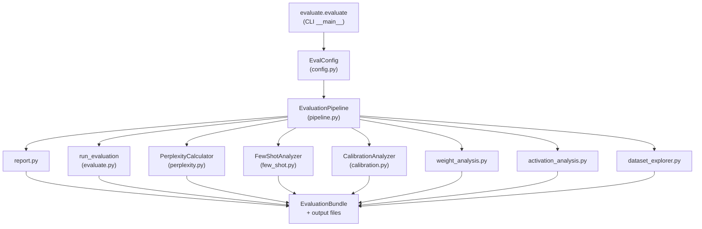

# Design Document: evaluate-improvements

## Overview

This design extends the `evaluate` module from a thin `lm-evaluation-harness` wrapper into a
professional evaluation pipeline. Eight gaps are closed: a CLI entry point, local model
evaluation, perplexity measurement, few-shot sensitivity analysis, calibration analysis,
rich dataset statistics, unified orchestration, and a narrative report with statistical
testing.

The target environment is CPU-only (AMD Ryzen 9). All new components are pure Python / PyTorch
and avoid GPU-specific code paths.

---

## Architecture

The pipeline follows a linear orchestration pattern. `EvaluationPipeline` is the single
entry point; it calls each analysis component in sequence, collects results into an
`EvaluationBundle` dict, and delegates report generation to the updated `report.py`.



Each step is wrapped in a `try/except` inside `EvaluationPipeline.run()`. A failure in any
step is logged via `JSONLogger` and the corresponding bundle key is set to `None`; the
pipeline always completes.

---

## Components and Interfaces

### `evaluate/pipeline.py` — `EvaluationPipeline`

```python
class EvaluationPipeline:
    def __init__(self, config: EvalConfig, logger: JSONLogger) -> None: ...
    def run(self) -> EvaluationBundle: ...
```

`run()` executes steps in this order:
1. Dataset statistics (`DatasetExplorer`)
2. Benchmark evaluation (`run_evaluation`) for each HF model
3. Local model evaluation (if `config.local_checkpoint_path` is set)
4. Perplexity (`PerplexityCalculator`) for each model
5. Few-shot sensitivity (`FewShotAnalyzer`) for each model
6. Calibration (`CalibrationAnalyzer`) for each model
7. Weight analysis (`weight_analysis`) for each model
8. Activation analysis (`activation_analysis`) for each model
9. Report generation (`generate_csv_report`, `generate_markdown_report`,
   `generate_narrative_report`)

Returns an `EvaluationBundle` (typed dict) with keys:
`benchmark_scores`, `perplexity`, `few_shot_sensitivity`, `calibration`,
`weight_analysis`, `activation_analysis`, `dataset_stats`, `local_model`.

### `evaluate/perplexity.py` — `PerplexityCalculator`

```python
class PerplexityCalculator:
    def __init__(self, model: nn.Module, tokenizer: Any, context_length: int,
                 logger: JSONLogger) -> None: ...
    def compute(self, corpus: str) -> float | None: ...
```

`compute()` tokenizes `corpus`, splits into non-overlapping windows of `context_length`
tokens, runs a forward pass on each window with `targets = input_ids[1:]`, accumulates
cross-entropy loss, and returns `math.exp(mean_loss)`. Returns `None` and logs a warning
if `corpus` is empty or tokenization fails.

### `evaluate/few_shot.py` — `FewShotAnalyzer`

```python
class FewShotAnalyzer:
    def __init__(self, config: EvalConfig, logger: JSONLogger) -> None: ...
    def run(self, model_name: str, lm_model: Any) -> dict[tuple[str, int], float | None]: ...
```

Iterates over `config.shot_counts` (a `dict[str, list[int]]`), calls
`lm_eval.simple_evaluate` for each `(task, n_shots)` pair, and returns a dict keyed by
`(task_name, n_shots)`. Failures are caught per-pair; `None` is recorded and the loop
continues.

### `evaluate/calibration.py` — `CalibrationAnalyzer`

```python
class CalibrationAnalyzer:
    def __init__(self, n_bins: int = 10, logger: JSONLogger | None = None) -> None: ...
    def compute_ece(self, confidences: list[float], labels: list[int]) -> float | None: ...
    def plot_reliability_diagram(self, confidences: list[float], labels: list[int],
                                  model_name: str, save_dir: str) -> str | None: ...
```

`compute_ece()` partitions `confidences` into 10 equal-width bins over [0, 1], computes
`bin_weight = bin_count / total`, and returns `sum(bin_weight * |mean_conf - accuracy|)`.
Returns `None` and logs a warning if `confidences` is empty.

`plot_reliability_diagram()` saves a PNG to `save_dir` and returns the file path.

### `evaluate/evaluate.py` — CLI block

The existing `run_evaluation()` function is unchanged. A new `if __name__ == "__main__":`
block is added using `argparse`:

```
python -m evaluate.evaluate [--config PATH]
```

Flags:
- `--config PATH` — path to a YAML file loaded via `load_config(path, EvalConfig)`
- `--help` — prints usage and exits 0

On missing config file: prints to stderr and exits with code 1.
On no flags: uses `EvalConfig()` defaults.

### `evaluate/dataset_explorer.py` — updates

New functions added to the existing module:

```python
def compute_ngram_overlap(train_texts: list[str], test_texts: list[str],
                           n: int = 1) -> float: ...
def compute_domain_distribution(samples: list[dict], label_field: str = "source") -> dict[str, float]: ...
def compute_length_distribution(texts: list[str], tokenizer: Any | None = None,
                                 save_path: str | None = None) -> list[int]: ...
```

`compute_ngram_overlap` returns the fraction of test n-grams that appear in the training
set. `compute_domain_distribution` returns a dict of label → proportion summing to 1.0.
`compute_length_distribution` uses the BPE tokenizer if available, falls back to
whitespace splitting with a logged warning.

### `evaluate/report.py` — updates

New functions added:

```python
def find_best_models(results: dict[str, dict[str, float | None]]) -> dict[str, str]: ...
def wilson_ci(p: float, n: int, z: float = 1.96) -> tuple[float, float]: ...
def two_proportion_ztest(n1: int, k1: int, n2: int, k2: int) -> float: ...
def generate_narrative_report(results: dict, perplexity: dict, calibration: dict,
                               few_shot: dict, output_path: str, n_samples: int = 1000) -> None: ...
```

`generate_narrative_report()` writes a Markdown file that includes:
- The existing results table with added Perplexity and ECE columns
- Best-model annotations (★) per task
- Wilson 95% CI bounds per cell
- Pairwise z-test p-values (flagged with * when p < 0.05)
- A narrative paragraph (≥ 50 words) naming the overall best model, tasks with
  significant differences, and calibration concerns

### `evaluate/config.py` — updates

```python
@dataclass
class EvalConfig(BaseConfig):
    # existing fields ...
    shot_counts: dict[str, list[int]] = field(default_factory=lambda: {
        "arc_challenge": [0, 1, 5, 25],
        "hellaswag": [0, 1, 10],
        "mmlu": [0, 5],
        "truthfulqa_mc": [0],
    })
    local_checkpoint_path: str | None = None
    perplexity_corpus: str = ""   # path to a plain-text file; empty = skip
```

### `evaluate/__init__.py` — updates

Expose the public API:

```python
from evaluate.pipeline import EvaluationPipeline
from evaluate.config import EvalConfig
from evaluate.perplexity import PerplexityCalculator
from evaluate.few_shot import FewShotAnalyzer
from evaluate.calibration import CalibrationAnalyzer
```

---

## Data Models

### `EvaluationBundle` (TypedDict)

```python
class EvaluationBundle(TypedDict):
    benchmark_scores:     dict[str, dict[str, float | None]]   # model -> task -> score
    perplexity:           dict[str, float | None]               # model -> ppl
    few_shot_sensitivity: dict[tuple[str, str, int], float | None]  # (model, task, shots) -> acc
    calibration:          dict[str, dict[str, Any] | None]      # model -> {ece, diagram_path}
    weight_analysis:      dict[str, Any | None]                 # model -> analysis dict
    activation_analysis:  dict[str, Any | None]                 # model -> analysis dict
    dataset_stats:        dict[str, Any] | None                 # ngram_overlap, domain_dist, lengths
    local_model:          dict[str, float | None] | None        # benchmark scores or None
```

All seven keys are always present; individual values may be `None` if the step failed.

### `EvalConfig` additions

| Field | Type | Default | Description |
|---|---|---|---|
| `shot_counts` | `dict[str, list[int]]` | per-task lists | Shot counts for few-shot sensitivity |
| `local_checkpoint_path` | `str \| None` | `None` | Path to `.pt` checkpoint |
| `perplexity_corpus` | `str` | `""` | Path to plain-text held-out corpus |

---

## Correctness Properties

*A property is a characteristic or behavior that should hold true across all valid executions
of a system — essentially, a formal statement about what the system should do. Properties
serve as the bridge between human-readable specifications and machine-verifiable correctness
guarantees.*

### Property 1: Perplexity lower bound and finiteness

*For any* non-empty token sequence and any model, `PerplexityCalculator.compute()` SHALL
return a finite float value ≥ 1.0. Cross-entropy loss is non-negative, so `exp(loss) ≥ 1`;
and for finite logits over a finite vocabulary the loss is always finite.

**Validates: Requirements 3.1, 3.2**

### Property 2: Perplexity windowing consistency

*For any* token sequence of length `L > context_length`, splitting into non-overlapping
windows and averaging the per-window loss SHALL produce the same perplexity as computing
the loss window-by-window manually. The windowing is a deterministic partition; order of
processing does not affect the mean.

**Validates: Requirements 3.3**

### Property 3: Few-shot result completeness

*For any* configuration with `M` models, `T` tasks, and `S_t` shot counts for task `t`,
the `"few_shot_sensitivity"` dict in `EvaluationBundle` SHALL contain exactly
`M × Σ_t S_t` entries — one per `(model, task, n_shots)` triple — with `None` for any
failed evaluation.

**Validates: Requirements 4.2, 4.5**

### Property 4: ECE range

*For any* list of `(confidence, label)` pairs where confidence ∈ [0, 1] and
label ∈ {0, 1}, `CalibrationAnalyzer.compute_ece()` SHALL return a value in [0, 1].
Each bin contributes `bin_weight × |mean_conf − accuracy|`; both factors are in [0, 1],
so the weighted sum is bounded by 1.

**Validates: Requirements 5.1**

### Property 5: ECE perfect calibration

*For any* set of predictions where mean confidence equals empirical accuracy in every
non-empty bin, `CalibrationAnalyzer.compute_ece()` SHALL return 0.0 (within 1e-6).

**Validates: Requirements 5.1**

*(Properties 4 and 5 are kept separate because they test different aspects of the ECE
formula: the range bound and the zero-case respectively.)*

### Property 6: N-gram overlap range

*For any* two non-empty text corpora, `compute_ngram_overlap()` SHALL return a value in
[0.0, 1.0]. Additionally, `compute_ngram_overlap(A, A)` SHALL equal 1.0 for any non-empty
corpus A (every test n-gram appears in the training set when they are identical).

**Validates: Requirements 6.1**

### Property 7: Domain distribution sums to 1

*For any* non-empty list of labeled samples, the values of the dict returned by
`compute_domain_distribution()` SHALL sum to 1.0 within floating-point tolerance of 1e-6.

**Validates: Requirements 6.2**

### Property 8: EvaluationBundle key completeness

*For any* valid `EvalConfig` with at least one model, the `EvaluationBundle` returned by
`EvaluationPipeline.run()` SHALL always contain all eight required top-level keys
(`benchmark_scores`, `perplexity`, `few_shot_sensitivity`, `calibration`,
`weight_analysis`, `activation_analysis`, `dataset_stats`, `local_model`), regardless of
which individual steps succeed or fail.

**Validates: Requirements 7.5, 7.6**

### Property 9: Best model correctness

*For any* results dict with two or more models and non-None scores, the model identified
as best for a given task by `find_best_models()` SHALL have the maximum score for that
task among all models with non-None scores.

**Validates: Requirements 8.1**

### Property 10: Wilson CI validity

*For any* score `p` ∈ [0, 1] and sample count `n` ≥ 1, the Wilson score interval
`[lower, upper]` computed by `wilson_ci()` SHALL satisfy `0 ≤ lower ≤ p ≤ upper ≤ 1`.

**Validates: Requirements 8.2**

### Property 11: Z-test p-value range

*For any* two sets of binary outcomes, the p-value returned by `two_proportion_ztest()`
SHALL be in [0.0, 1.0].

**Validates: Requirements 8.3**

---

## Error Handling

| Scenario | Behaviour |
|---|---|
| `local_checkpoint_path` does not exist | Log warning, set `local_model = None`, continue |
| `perplexity_corpus` is empty or unreadable | Log warning, set `perplexity[model] = None` |
| `lm_eval` not installed | Log warning, return `{task: None}` for all tasks |
| Individual `(task, n_shots)` evaluation fails | Log error, record `None`, continue loop |
| Calibration: no confidence scores | Log warning, set `ece = None` |
| Tokenizer load failure in dataset explorer | Log warning, fall back to whitespace split |
| Any pipeline step raises unhandled exception | Log error with traceback, set bundle key to `None`, continue |
| CLI `--config` path does not exist | Print to stderr, exit code 1 |

All errors are logged as structured JSON via `JSONLogger` with keys `type`, `model_name`
(where applicable), `error_type`, and `traceback_summary`.

---

## Testing Strategy

### Unit tests (example-based)

Located in `evaluate/tests/`. Each new module gets a corresponding test file:

- `test_pipeline.py` — pipeline orchestration, bundle key completeness, step skipping
- `test_perplexity.py` — windowing logic, empty corpus, None return
- `test_few_shot.py` — result dict structure, failure handling
- `test_calibration.py` — ECE formula, perfect calibration, empty input
- `test_dataset_explorer_extended.py` — n-gram overlap, domain distribution, length distribution
- `test_report_extended.py` — best model annotation, Wilson CI, z-test, narrative length

Unit tests use `unittest.mock` to avoid real model loading and `lm_eval` calls.

### Property-based tests (Hypothesis)

The project uses [Hypothesis](https://hypothesis.readthedocs.io/) for property-based
testing. Each property test is tagged with a comment referencing the design property.
Minimum 100 examples per test (`@settings(max_examples=100)`).

Tag format: `# Feature: evaluate-improvements, Property N: <property_text>`

**Property 1 — Perplexity lower bound and finiteness**
Generate random token sequences (lengths 1–512) and a tiny randomly-initialised
`GPTModel`. Assert `compute()` returns a finite float ≥ 1.0.

**Property 2 — Perplexity windowing consistency**
Generate sequences longer than `context_length`. Compute perplexity via
`PerplexityCalculator` and also manually window-by-window. Assert results match within
1e-5.

**Property 3 — Few-shot result completeness**
Generate random `(M, T, S_t)` configurations with mock `lm_eval`. Inject random failures.
Assert result dict has exactly `M × Σ S_t` entries with `None` for failures.

**Property 4 — ECE range**
Generate random lists of `(confidence, label)` pairs. Assert ECE ∈ [0, 1].

**Property 5 — ECE perfect calibration**
Construct synthetic data where mean confidence equals accuracy in every bin. Assert
ECE = 0.0 within 1e-6.

**Property 6 — N-gram overlap range**
Generate random text corpora. Assert overlap ∈ [0, 1] and overlap(A, A) = 1.0.

**Property 7 — Domain distribution sums to 1**
Generate random labeled sample lists. Assert sum of distribution values = 1.0 within 1e-6.

**Property 8 — Bundle key completeness**
Generate random `EvalConfig` instances. Inject random step failures. Assert all 8 bundle
keys always present.

**Property 9 — Best model correctness**
Generate random results dicts with 2–5 models and random scores. Assert identified best
model has maximum score per task.

**Property 10 — Wilson CI validity**
Generate random `(p, n)` pairs with `p ∈ [0, 1]`, `n ≥ 1`. Assert
`0 ≤ lower ≤ p ≤ upper ≤ 1`.

**Property 11 — Z-test p-value range**
Generate random binary outcome counts. Assert p-value ∈ [0, 1].
